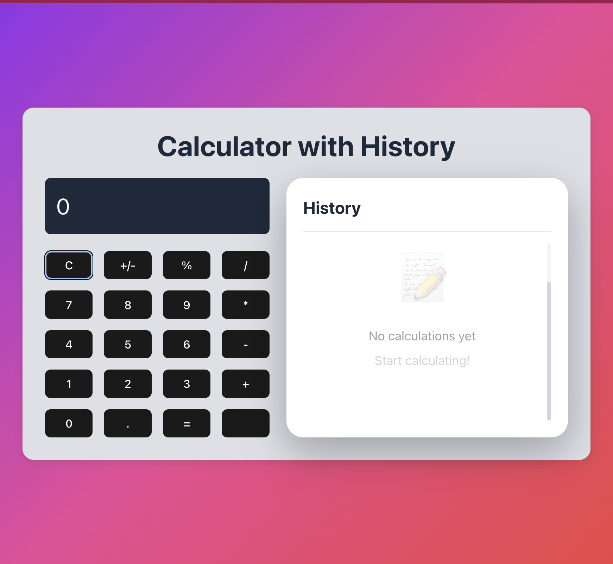

# Calculator with History 🧮

A modern, responsive calculator built with React and TypeScript featuring a real-time calculation history panel.



## ✨ Features

- ✅ **Basic Operations**: Addition, subtraction, multiplication, division
- ✅ **History Panel**: Side-by-side history tracking showing all calculations
- ✅ **Responsive Design**: Beautiful purple gradient background
- ✅ **Real-time Updates**: Calculations appear instantly in history
- ✅ **Clear History**: One-click to clear all history
- ✅ **Modern UI**: Clean interface with smooth hover effects
- ✅ **Error Handling**: Graceful error messages for invalid operations

## 🚀 Live Demo

Check out the live calculator [here](#) <!-- Add deployment link if you deploy -->

## 🛠️ Tech Stack

- **React** - UI Library
- **TypeScript** - Type Safety
- **CSS3** - Custom Styling
- **Vite** - Build Tool

## 📦 Installation & Setup

1. **Clone the repository**
```bash
git clone https://github.com/SriyaDhakal/calculator-with-history.git
cd calculator-with-history
```

2. **Install dependencies**
```bash
npm install
```

3. **Run development server**
```bash
npm run dev
```

4. **Open in browser**
```
http://localhost:5173
```

## 📁 Project Structure
```
calculator-with-history/
├── src/
│   ├── Components/
│   │   ├── Display.tsx         # Calculator display component
│   │   ├── Display.css
│   │   ├── ButtonGrid.tsx      # Button layout grid
│   │   ├── ButtonGrid.css
│   │   ├── Button.tsx          # Individual button component
│   │   ├── Button.css
│   │   ├── History.tsx         # History panel component
│   │   └── History.css
│   ├── App.tsx                 # Main app component
│   ├── App.css                 # Global styles
│   └── main.tsx
├── screenshots/
├── package.json
└── README.md
```

## 🎯 How to Use

### Basic Calculations
1. Click numbers to build your expression
2. Click an operator (+, -, ×, ÷)
3. Click more numbers
4. Press `=` to see the result
5. Result appears in the display AND in the history panel

### Special Functions
- **C** - Clear current expression
- **+/-** - Toggle positive/negative
- **%** - Convert to percentage
- **.** - Add decimal point

### History Panel
- View all past calculations
- Automatically shows newest first
- Click "Clear" button to remove all history
- Shows total calculation count

## 🖼️ Screenshots

### Main Interface


### Features Showcase
- Modern gradient background
- Side-by-side layout (calculator + history)
- Clean, intuitive design
- Responsive on all devices

## 🎨 Key Features Explained

### Component Architecture
- **Modular Design**: Separate components for display, buttons, and history
- **TypeScript**: Full type safety throughout
- **Props**: Clear interfaces for component communication
- **State Management**: React hooks (useState)

### Styling
- Custom CSS with flexbox and grid layouts
- Gradient backgrounds for visual appeal
- Hover effects on all interactive elements
- Smooth transitions and animations
- Custom scrollbar for history panel

## 🚧 Known Limitations

- Currently uses `eval()` for calculations (planned to replace with safer parser)

## 🔮 Future Enhancements

- [ ] Keyboard support for typing calculations
- [ ] Save history to localStorage (persist after refresh)
- [ ] Export history as text or CSV
- [ ] Scientific calculator mode
- [ ] Memory functions (M+, M-, MR, MC)
- [ ] Themes (dark mode, different color schemes)
- [ ] Calculation history with timestamps
- [ ] Undo/Redo functionality

## 🤝 Contributing

Contributions are welcome! Feel free to:
1. Fork the repository
2. Create a feature branch (`git checkout -b feature/AmazingFeature`)
3. Commit your changes (`git commit -m 'Add AmazingFeature'`)
4. Push to the branch (`git push origin feature/AmazingFeature`)
5. Open a Pull Request

## 📝 What I Learned

Building this project helped me learn:
- React component architecture and props
- TypeScript interfaces and type safety
- CSS Flexbox and Grid layouts
- State management with React hooks
- Event handling in React
- Creating reusable components
- Git version control and GitHub workflow

## 👨‍💻 Author

**Sriya Dhakal**

- GitHub: [@SriyaDhakal](https://github.com/SriyaDhakal)
- LinkedIn: [Your LinkedIn Profile](https://linkedin.com/in/your-profile)
- Location: Lubbock, Texas

## 🙏 Acknowledgments

- Inspired by modern calculator designs
- Built while learning React and TypeScript
- Thanks to the open-source community

## 📄 License

This project is open source and available under the [MIT License](LICENSE).

---

⭐ **If you found this project helpful, please consider giving it a star!** ⭐

## 📧 Contact

For questions or feedback, feel free to reach out or open an issue!

---

**Made with ❤️ by Sriya Dhakal**